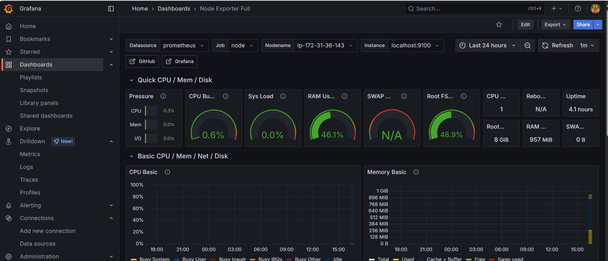
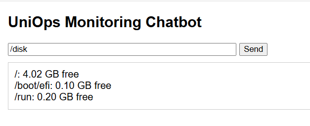

# 🚀 UniOps Platform  
**Smart Infrastructure Monitoring and Support Platform**

UniOps is a cloud-based infrastructure project that demonstrates hands-on skills in provisioning, automation, and monitoring. It leverages industry-standard tools such as **Terraform**, **Ansible**, **AWS EC2**, and **Prometheus Node Exporter**. Designed for real-world DevOps workflows, the platform supports scalable infrastructure setup and system-level monitoring, along with a chatbot-based support system.

---

## 🛠️ Technologies Used

| Layer              | Tools & Technologies              |
|--------------------|----------------------------------|
| Infrastructure     | Terraform (AWS EC2)              |
| Configuration Mgmt | Ansible                          |
| Monitoring         | Prometheus, Node Exporter, Grafana|
| Web Server         | Nginx (simulated traffic)        |
| Automation Shell   | GitHub + Ansible Playbooks       |
| OS & Platform      | Ubuntu 22.04 on EC2 via WSL      |

---

## 📦 Project Structure

```
uniops-platform/
├── infra/                 # Terraform files
├── ansible/               # Ansible playbooks and inventory
├── backend/               # Flask-based chatbot backend
│   ├── app.py             # Chatbot logic and endpoints
│   └── requirements.txt   # Python dependencies
├── frontend/              # HTML/JS Chatbot UI
│   ├── index.html
│   └── script.js
├── .github/workflows/     # GitHub Actions CI/CD
├── .gitignore
└── README.md
```

---

## ⚙️ Project Phases

- ✅ **Phase 1**: GitHub Repository Setup  
- ✅ **Phase 2**: EC2 Provisioning using Terraform  
- ✅ **Phase 3**: Server Configuration with Ansible (Python, Nginx, Node Exporter)  
- ✅ **Phase 4**: Monitoring Dashboards (Prometheus & Grafana)  
- 🔄 **Phase 5**: Support Automation (Chatbot, Alerting, CI/CD)

---

## 🌐 Live Monitoring Example

> Metrics Endpoint:  
> `http://<your-ec2-ip>:9100/metrics`

---

## 📸 Screenshots

- 
- 
- 
- 
- 

---

## 🚀 How to Use This Project

This section guides you through deploying and running UniOps — a cloud monitoring and support solution using EC2, Terraform, Ansible, Prometheus, Grafana, and a Flask chatbot.

### ✅ Prerequisites

- AWS account with IAM user and access key  
- SSH PEM key (e.g., `keyPair.pem`)  
- Locally installed: Terraform, Ansible, AWS CLI, Git

---

### 🧱 Project Setup

#### 1. Clone the Repository
```bash
git clone https://github.com/SaeidNK/uniops-platform.git
cd uniops-platform
```

#### 2. Configure AWS Credentials
```bash
aws configure
```
Enter:
- AWS Access Key ID  
- AWS Secret Access Key  
- Region (e.g., `eu-west-2`)  
- Output format (e.g., `json`)

#### 3. Provision EC2 with Terraform
```bash
cd infra
terraform init
terraform apply
```
This will launch an EC2 instance and output its public IP.

#### 4. Provision Server with Ansible

Move your PEM key:
```bash
mkdir -p ~/.ssh
cp path/to/keyPair.pem ~/.ssh/uniops-key.pem
chmod 400 ~/.ssh/uniops-key.pem
```

Create/edit the inventory file:
```ini
[uniops]
<your-ec2-ip> ansible_user=ubuntu ansible_ssh_private_key_file=~/.ssh/uniops-key.pem
```

Run the playbook:
```bash
cd ../ansible
ansible-playbook -i inventory.ini playbook.yml
```

#### 5. Start Flask Chatbot Service
```bash
ssh -i ~/.ssh/uniops-key.pem ubuntu@<your-ec2-ip>
cd ~/uniops_chatbot/backend
sudo systemctl start uniops-chatbot
sudo systemctl enable uniops-chatbot
```

Verify:
```bash
curl http://localhost:5000/cpu
```

---

## 🌐 Access URLs

| Component       | URL Example                        |
|----------------|------------------------------------|
| Web Chat UI     | `http://<your-ec2-ip>`            |
| Chatbot API     | `http://<your-ec2-ip>:5000/ask`   |
| Prometheus      | `http://<your-ec2-ip>:9090`       |
| Node Exporter   | `http://<your-ec2-ip>:9100/metrics` |
| Grafana         | `http://<your-ec2-ip>:3000`       |

(Default Grafana login: `admin` / `admin`)

⚠️ Ensure ports 22, 80, 3000, 5000, 9090, and 9100 are open in your EC2 security group.

---

## 🧪 Example Usage

Query the chatbot:
```bash
curl -X POST http://<your-ec2-ip>:5000/ask   -H "Content-Type: application/json"   -d '{"query":"/cpu"}'
```

Or use the frontend to enter commands like `/cpu`, `/disk`, `/memory`, etc.
